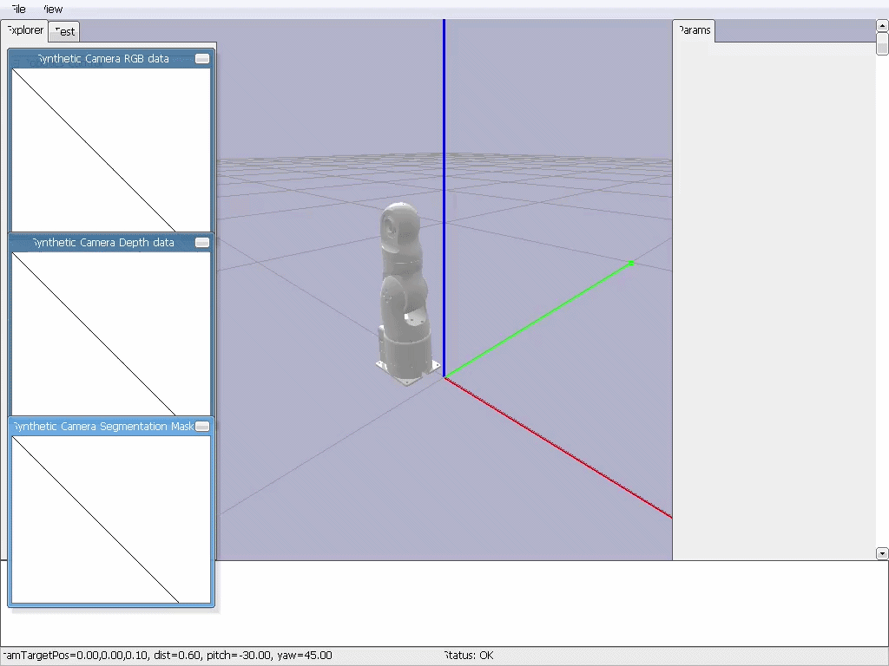
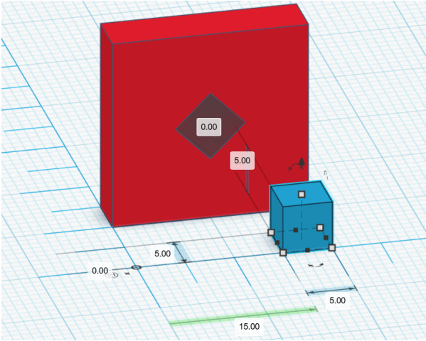

# 7-DOF Robotic Manipulation with SE(3) Trajectory Planning

A robotics project implementing **SE(3) trajectory generation**, **Product of Exponentials kinematics**, **Jacobian pseudoinverse task-space control**, and a **PyBullet kinematic simulator** for the **Elephant myArm 300 Pi** robotic manipulator.

> Developed as part of the *Introduction to Robotics* course at the University of Patras.

---

## Demo

> **Final pick-and-place manipulation**

<p align="center">
  <!-- Replace with GIF or MP4 preview -->
  
</p>

The robot:

- Approaches and grasps the blue cube.
- Moves it along a planned trajectory in **SE(3)**.
- Places it to the insertion pose.
- Aligns it with the box opening (that it cant be shown in PyBullet) inside a PyBullet simulation.

---

## Project Overview

This project implements the complete kinematic pipeline for a robotic manipulation task using a **7-DOF Elephant myArm 300 Pi** robotic arm.

It combines basic knowledge from Robotics academic courses.

### Features

- Forward kinematics using the **Product of Exponentials (PoE)** .
- Homogeneous transformations in **SE(3)**.
- Geometric Jacobian computation via exponentials.
- Newton–Raphson inverse kinematics.
- Cubic polynomial trajectory generation in task space.
- Jacobian pseudoinverse task-space velocity controller.
- Kinematic simulation in **PyBullet** with grasping constraints.

---

## Manipulation Task

The robot is required to move a cube from its initial position to a target insertion pose next to a box opening.

<p align="center">
  <!-- Replace with your environment image -->
  
</p>

The manipulation consists of two main stages:

1. **Grasp Pose** — reach and grasp the cube with the correct end-effector orientation.
2. **Insertion Pose** — transport the cube and align it with the hole in the box.

---

## Motion Planning Pipeline

```text
Robot Model (PoE)
        │
        ▼
SE(3) Transformation Frames
        │
        ▼
Cubic Task-Space Trajectory
        │
        ▼
Jacobian Pseudoinverse Controller
        │
        ▼
Joint Velocity Integration
        │
        ▼
Joint Trajectory
        │
        ▼
PyBullet Simulation
```

---

## Repository Structure

```text
.
├── code/               # Executables
├── assets/             # Necessary files
├── media/              # GIFs, videos and images
├── docs/               # Detailed technical documentation 
├── requirements.txt
└── README.md
```

---

## Quick Start

### Clone the repository

```bash
git clone https://github.com/<AlexhsMei>/<7DOF-Robotic-Arm-SE3-simulation>.git
cd <7DOF-Robotic-Arm-SE3-simulation>
```

### Install dependencies

```bash
pip install -r requirements.txt
```

### Generate trajectories

Run the notebook that generates the joint trajectories.

```bash
jupyter notebook code/hw3_code.ipynb
```

### Launch the simulator

```bash
python code/simulator.py
```

---

## Technical Documentation

A detailed explanation of the mathematical formulation, controller implementation, trajectory generation, and simulation architecture is available in:

**→ [`docs/`](docs/)**

The documentation includes:

- Coordinate frame definitions.
- SE(3) transformation derivations.
- Product of Exponentials formulation.
- Jacobian computation.
- Task-space velocity controller.
- PyBullet simulator implementation.

---

## Technologies

- Python
- NumPy
- SciPy
- Matplotlib
- PyBullet
- Jupyter Notebook

---

## Project Context

This repository contains the implementation developed for the project of the **Introduction to Robotics** course. The goal of the assignment was to design a complete kinematic manipulation pipeline for a 7-DOF robotic arm, from trajectory planning in **SE(3)** to execution inside a custom kinematic simulator.